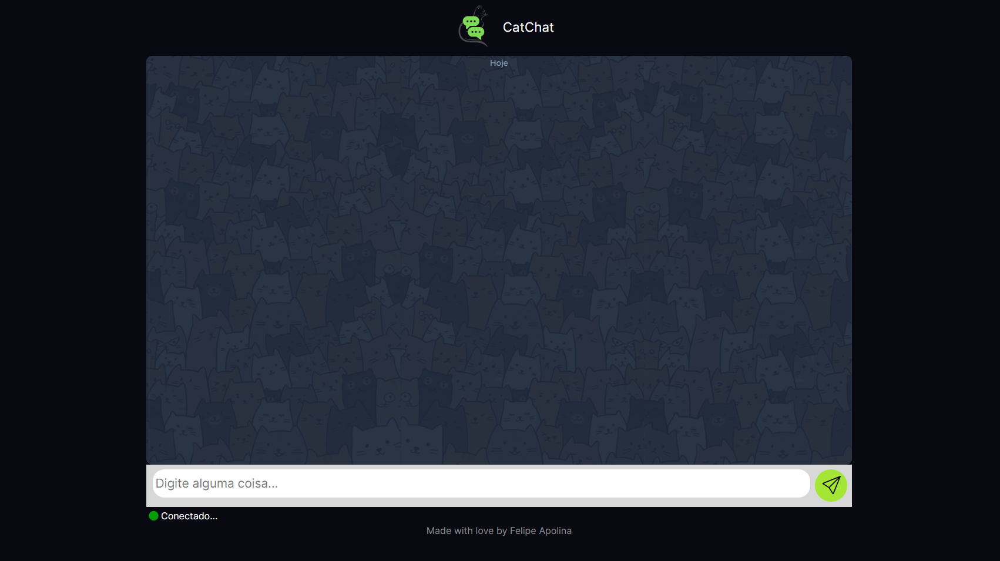

# CatChat

 Projeto feito com NodeJS, utilizando Express e Socket.io.

## Recursos Principais
- Possibilidade de criar um canal de comunicação na própria rede, capaz de enviar e receber mensagens de texto.

## Como Usar
- Você pode acessar o projeto aqui:
  [Em desenvolvimento]

## Executar Localmente

Clone o projeto

```bash
  git clone https://github.com/feapolina/cat-chat-node.git
```

Vá para o diretorio do projeto

```bash
  Execute o arquivo "index.html"
```


## Tecnologias Utilizadas

### Back end:
NodeJS com Express para criação da lógica da aplicação.

### Front end:
- HTML, CSS


## Autores:

- [@feapolina](https://github.com/feapolina)

## Feedback

Se você tiver algum feedback, entre em contato pelo email: fe.cavalcanti2016@gmail.com
